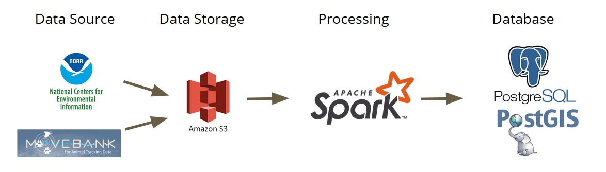

# MigrationPlus
MigrationPlus is a data pipeline for researchers studying animal migrations to join their data
 from tracking sensors with the weather conditions on the day of observation. 
This project was developed while being a Data Engineering Fellow at Insight Data Science
in Boston session 19B.

## Pipeline

## Data Sources

## Installation

